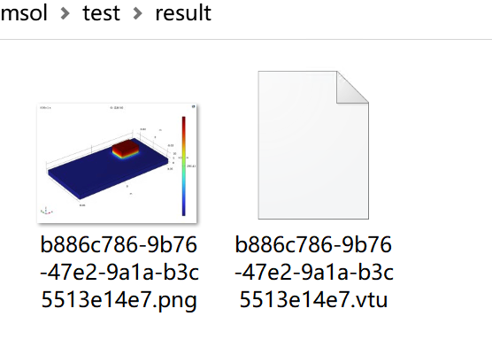

# comsol-gen
comsol by Java API  二次开发，自动化构建模型、计算和导出结果等


### 固体传热Demo

> HtTest.java

#### 编译

```
> comsolcompile -classpathadd W:\workspace\github\comsol-gen\target\comsol-gen.jar HtTest.java

```


#### 运行
```
> comsolbatch -classpathadd W:\workspace\github\comsol-gen\target\comsol-gen.jar -inputfile HtTest.class
*******************************************
***COMSOL 6.0.0.318 progress output file***
*******************************************
Wed Nov 08 17:31:10 CST 2023
COMSOL Multiphysics 6.0 (开发版本: 318) 在批处理模式下启动
正在运行: W:\workspace\github\comsol-gen\src\main\java\HtTest.class
---------- 当前进度: 100 % - 正在更新选择
...
...
...
---------- 当前进度: 100 % - 完成
Memory: 953/983 1084/1113

```


#### 结果
